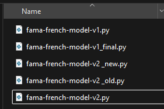
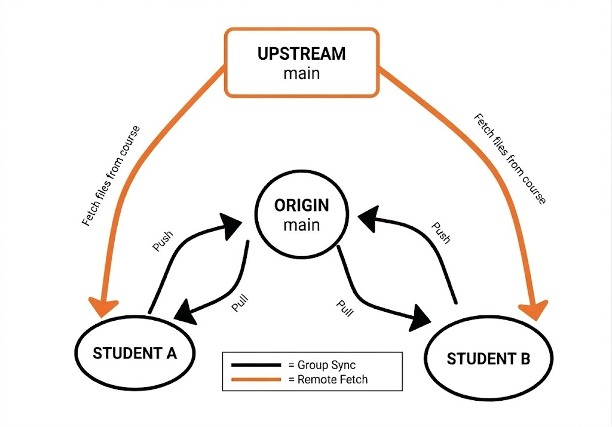
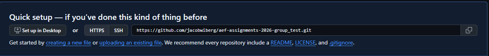
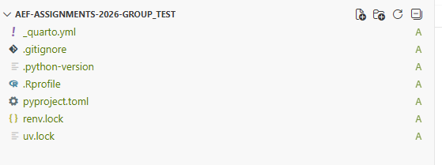

# Collaboration with Git and GitHub

In this section, we will cover the basics of collaborating on code projects using Git and GitHub. We will go through the essential commands and workflows that you need to know to effectively collaborate with others on coding projects such as your mandatory assignments.  

First, some introduction is in order before we start. ***Git*** is a version control system, which allows one or multiple people to work on a project simultaneously without overwriting each other's work. It keeps track of changes made to files and allows you to revert back to previous versions if needed. ***GitHub*** is a web-based platform that provides hosting for Git repositories, making it easier to collaborate with others and share your code.


#### Why use Git and GitHub for collaboration?

Most people have at some point ended up with multiple versions of the same file on their computer (see figure 1), which not only makes it hard for yourself to keep track of the most recent version, but also makes it difficult to collaborate with others, as you may end up sending different versions of the same file back and forth. 

{fig-align="center"}

**There is also a good chance that you will encounter Git and Github at some point in your future career**, as it is the industry standard for version control and collaboration on code projects. The goal of this overview is not to make you an expert nor cover all the features of Git, but rather to give you a basic understanding of the tools and an opportunity to use them, by showing you how to set up a GitHub repository to collaborate with your group on the mandatory assignments.


#### Are there any limitations?

An important note is that Git and GitHub are primarily designed for collaboration on code projects. This is essentially done by sharing - i.e. pushing and pulling - *commits* (which are snapshots of your project at a specific point in time) to and from a shared repository on GitHub. This also means that there is no live-editing as in Overleaf or similar, so you won't be able to see each other's changes in real-time. I would recommend either working on the models in python files separate from your quarto-document - for example creating files such as `mean-variance-pfo.py` and adding the code to the quarto document afterwards, or at the very least, work on different sections of the quarto document to avoid merge conflicts.


### Overview of the workflow

The workflow outlined below only needs to be done by one person in your group (Student A). After Student A has set up the GitHub repository and pushed the initial files, the other group members (Student B and C) can simply clone the repository to their local machines and pull down the files.


{fig-align="center"}


#### Part 1 - Creating a GitHub repository for your group.

1. Go to [GitHub.com](https://github.com) and click on the green *"New"* button at the left side of your screen. You may also navigate to the "Repositories" tab on your profile (top right corner) and click on the *"New"* button there.

2. Choose a name for your repository (e.g. *"AEF-2026-Assignments-Group1"*). Add a description and set the visibility to "Private" (such that only you and your group members can access it). You do not need to initialize the repository with a README or .gitignore file. Click *"Create repository"*

3. Copy the HTTPS URL of this new repository.

{fig-align="center"}

4. Add collaborators: On GitHub, go to your new repository’s main page, click on the *"Settings"* tab, then select *"Collaborators"* (or *"Collaborators and teams"*). Click *"Add people"*, search for your group members by their GitHub username or email, and send them invitations. Each group member must accept the invitation (they will receive an email and/or a notification on GitHub) before they can push changes to the repository.


#### Part 2 - Making a local copy of the repository through Positron

1. Within Positron, click on *"New"* (top left corner) and then select *"New folder from Git"*. 

2. Paste the URL of your new GitHub repository and click OK. This will create a local copy of the empty repository on your computer, which you can work on and later push changes to GitHub. If you're prompted by the Git Credential Manager, log in.

3. Go to the terminal window in Positron. The default terminal will most likely be PowerShell on Windows, but you can change this to Git Bash (which I recommend) or any terminal of your choice.


#### Part 3 - Connecting to the course repository and grabbing files

1. As of now, our newly created repository is empty. In order to access the course materials, such as the mandatory assignment files, we will add an "upstream" connection to the course repository. This will allow us to pull changes from the course repository into our local repository, which we can then push to our GitHub repository. In the terminal, write `git remote add upstream https://github.com/advanced-empirical-finance/course-repository.git` and press enter.

2. To verify that it worked, you can write `git remote -v` in the terminal. Your output should look something like this:

```bash
origin   https://github.com/your-username/AEF-Assignments-Group1.git (fetch)
origin   https://github.com/your-username/AEF-Assignments-Group1.git (push)
upstream https://github.com/advanced-empirical-finance/course-repository.git (fetch)
upstream https://github.com/advanced-empirical-finance/course-repository.git (push)
```


3. We don't necessarily need all the files from the course repository, so to get the specific files we need, we will use the *checkout* command instead of the *pull* command for this part. First, write `git fetch upstream` to load the latest changes from the course repository. Second, grab the environment files by writing `git checkout upstream/main -- renv.lock uv.lock .Rprofile pyproject.toml _quarto.yml .python-version .gitignore`. This will copy the specified files from the course repository to your local repository and you should see them appear in the file explorer on the left side of Positron. (Note that to add an entire folder you simply need to write `git checkout upstream/main -- foldername/` and it will copy the entire folder with all its contents).

4. Grab the assignment files, e.g. by grabbing the whole folder or by writing `git checkout upstream/main -- mandatory-assignments/MA_1_portfolio_choice_2026.pdf mandatory-assignments/MA_python_template.qmd` (if using Python, choose similarly for R).


{fig-align="center"}

#### Part 4 (Optional) - Organizing the folder structure

1. If you want a different folder structure, e.g. a folder for each assignment, you can simply move the files around in the file explorer on the left side of Positron. You can also use the terminal by writing `mkdir "Assignment 1"` to create a new folder, `mv mandatory-assignments/MA_1_portfolio_choice_2026.pdf "Assignment 1/"` `mv mandatory-assignments/MA_python_template.qmd "Assignment 1/"` to move the assignment files and `rmdir mandatory-assignments` to remove the now empty folder. Leave the environment files in the main root folder.

#### Part 5 - Saving and sharing your work with Git and GitHub

1. We now have the files that we need. However, these are only saved locally on your computer as for now (you can check GitHub and see that the repository is still empty). Therefore, we need to push our changes to GitHub, such that our other group members can access the files and we can collaborate on them.

2. To do this, we first need to add the files to the staging area by writing `git add .` (the dot means that we want to add all the files in the current folder and subfolders). You can also specify specific files instead of adding everything through `git add filename`, e.g. if you've changed multiple files but you only want to share some of them. Think of the staging area as where you select which changes you want to include in your next commit.

3. Next, we need to commit our changes by writing `git commit -m "Initial commit with environment and assignment files"`. The message in the quotation marks should be a brief description of the changes you've made, which will help you and your collaborators keep track of the history of changes in the project. This will create a snapshot of your project at this point in time, which you can revert back to if needed. You can make multiple commits as you work on the project, and each commit will be saved in the history of the project. These commits (snapshots) are what you will be sharing with your collaborators through GitHub, by pushing them to the shared repository.

4. Finally, we need to push our changes to GitHub by writing `git push origin main`. This will upload your committed changes to the GitHub repository, making them accessible to your collaborators. You can check the repository on GitHub and you should see that the files have been added.

5. **Student B and C can now clone the repository to their local machines** and simply write `git pull origin main` to pull down the files that Student A has pushed to GitHub. Your assignment files are now shared and you can collaborate on them by making changes locally, committing those changes, and pushing them to GitHub. Remember to pull down the latest changes from GitHub before you start working, to ensure that you're working on the most up-to-date version of the files. You can do this by writing `git pull origin main` in the terminal when you start working.

#### Part 6 - Keeping your repository up to date with the course repository

1. If there are updates to the course repository which you would like to add to your assignment repository, or when the next assignment is released, you can simply load the latest changes from the course repository by writing `git fetch upstream` and then `git checkout upstream/main -- files_or_folders_you_want_to_update`. I do **not** recommend using the `git pull upstream main` command here, as this will pull all the changes from the course repository and may cause merge conflicts. 

2. To share the updates with your group members, simply do as before, to push it to Github by \
`git add .` \
`git commit -m "Updated files with latest changes from course repository"` \
`git push origin main`


#### Part 7 - The daily workflow

1. Make sure that you're working on the latest version of your group's repository by writing `git pull origin main` in the terminal before you start working.

2. Open or create the files you want to work on and make your changes, while saving the work regularly.

3. Once you've finished a task or want to share your changes, proceed as in part 5 and 6 to add (`git add .`), commit (`git commit -m "message here"`), and push (`git push origin main`) your changes to your groups repository on GitHub. 
