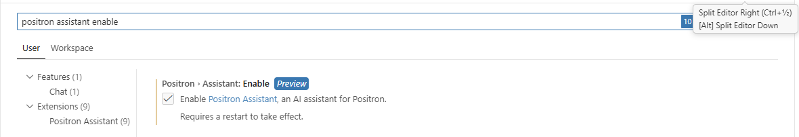
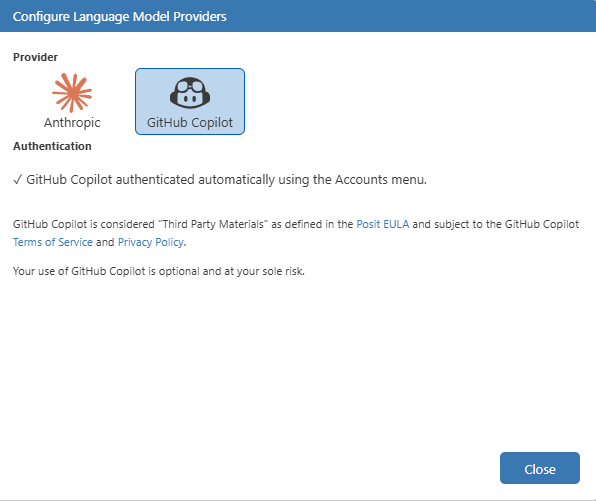
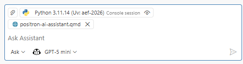
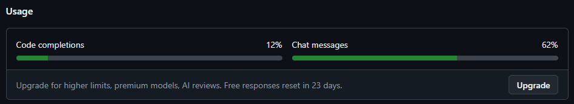
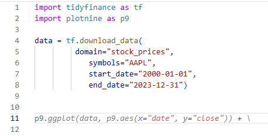
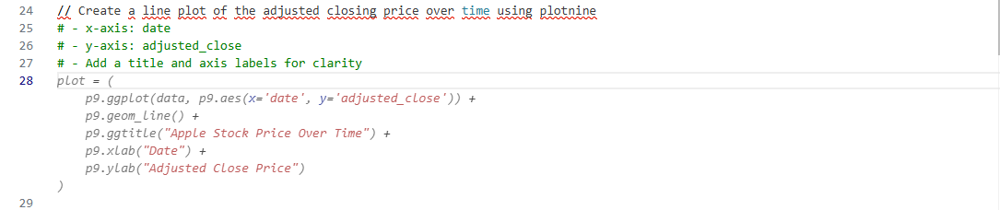
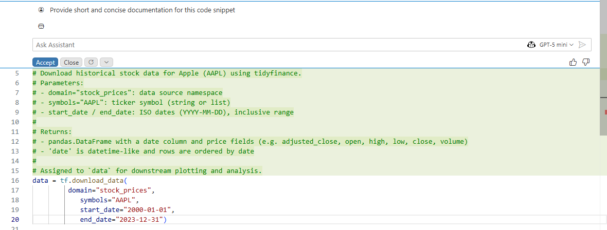

Positron offers several AI-powered features to assist you in your work, including the Positron Assistant Chat and Code Completion with GitHub Copilot. These tools are designed to help you save time, increase efficiency, and enhance your overall productivity. For a more detailed introduction to the Positron Assistant, we recommend reading the [Positron Assistant Introduction](https://positron.posit.co/assistant) including their guide for getting started. 

Before we begin, remember that AI assistants are not perfect and may sometimes provide incorrect or suboptimal suggestions. **Always review the suggestions provided by the assistant and use your own judgment when deciding whether to accept them.**

## Setting up Positron Assistant

To set up the Positron Assistant, you will first need to enable it in the Positron settings. You may either click on the `Chat` tab at the left side bar (`Ctrl + Alt + I`) and enter the settings through there, *or* by clicking the small gear in the bottom left corner ("Manage" -> "Settings"). Write `"Positron Assistant Enable"` in the search bar and **check the first box**.

After you've checked this box, you need to **restart Positron**. This is most easily done by pressing `Ctrl + Shift + P` and then writing *"Reload window"*. Choose the `"Developer: Reload Window"` option.

Next we need to choose a large language model provider. By default, you may choose between Anthropic or GitHub Copilot. Note that the *code completion* feature explained below is only available with GitHub Copilot as of now.

I've chosen to use GitHub Copilot. To connect with your GitHub account, press `Ctrl + Shift + P` and write `Positron Assistant: Configure Language Model Providers`. Select GitHub Copilot and press the *Sign In* button to initialize GutHub's OAuth authentication flow. Follow the instructions to log in to your GitHub account and authorize Positron to access your Copilot subscription. After successful authentication, you should see a confirmation message in Positron.

**Important note**: If you don't seem to have any model connected (i.e. at the bottom of the Positron Assistant Chat panel, if your chat-model is not "GPT-5 mini" after authenticating with GitHub Copilot), you may need to check your settings at github.com under [Copilot settings](https://github.com/settings/copilot/features) to ensure that you have access and activated your Github Copilot subscription.

## Positron AI

Within Positron, you have several options to utilize the AI assistant, including a main chat interface, code completion features, and an inline chat function. Each of these features is designed to provide you with different ways to interact with the assistant and get the help you need.

### Chat interface - Context, models and modes

At the bottom of the main chat interface, you will find a button to switch between different modes of interaction with the AI assistant: *'Ask'*, *'Edit'*, and *'Agent'* mode, a button to choose your desired large language model (e.g. *GPT-5 mini*) and the option to provide additional context for the assistant to use in its responses. The context can be any relevant information that you want the assistant to consider when generating its responses, such as project details, specific requirements, or any other information that may help the assistant provide more accurate and relevant answers. Examples include project descriptions, code snippets, documentation on your (teams) coding style, etc.

With respect to the different modes, there are three main options.

- **Ask mode**: This is the default mode where you can ask the assistant questions or request information. Think of it as having ChatGPT embedded directly in the side panel. The assistant will provide responses based on your queries, which can be related to coding, documentation, or general knowledge. \
- **Edit mode**: In this mode, you can provide the assistant with a piece of code or text and ask it to edit or improve it. For example, you can ask the assistant to optimize a function, rewrite a paragraph for clarity, or suggest improvements to your code. \
- **Agent mode**: This mode allows you to set up a more complex interaction with the assistant, including multi-step tasks and workflow planning across the entire project.

We will primarily be working with the **ask** and **edit** modes in this course, as they are the most commonly used for coding assistance and documentation generation.

*Exercise: Try asking the assistant "Can you summarize the main essential equations I need on mean variance portfolio optimization?" in ask mode, and then switch to edit mode to ask it to "Write a function that calculates the optimal portfolio weights based on the mean-variance optimization framework".*

### Code Completion with GitHub Copilot

Given that you've chosen to use GitHub Copilot as the large language model provider, you may take advantage of the **code completion** feature. This allows you to receive so called *'ghost text'* suggestions as you write, which are greyed-out text that appears as you type, suggesting completions for your code or text.

Note that for the standard free setup (Copilot Free plan through Github), there is a usage limit which you may find on GitHub.com under [Copilot settings](https://github.com/settings/copilot/features)

The suggestions will appear naturally as you write. You can accept the suggestions by pressing `Tab` or `Ctrl + Right Arrow` on Windows/Linux, or `Option + Right Arrow` on Mac. You can also cycle through different suggestions by pressing `Ctrl + Space` (or `Cmd + Space` on Mac) after the initial suggestion appears.

It is also possible to give *code suggestions* by writing `// ` followed by a text prompt, which will trigger the assistant to generate a suggestion based on the prompt. This is particularly useful for generating code, if you're e.g. unsure about the syntax for a specific function or package.

### Inline chat

In addition to the main chat interface, Positron also offers an *inline chat* feature. This allows you to use the AI assistant directly within your code or text editor, without needing to switch to a separate chat window. You can access the inline chat by `Ctrl + i` (or `Cmd + i` on Mac) while your cursor is in the editor. This will open a small chat interface where you can ask questions or request assistance related to the code or text you're working on, which is ideal for assistance with very specific lines of code, e.g. *"Write documentation for this function"*, *"Explain this line of code"*, *"Rewrite this as a function instead"*, etc.

After providing the inline chat with a prompt, the assistant will generate a response and insert it directly into your code or text editor at the location of your cursor. You can then accept the suggestion, modify it, or ask for a different response if needed.  

