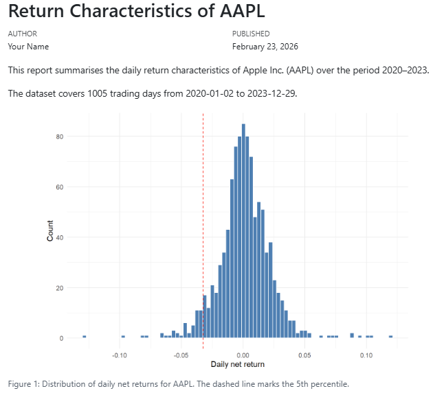
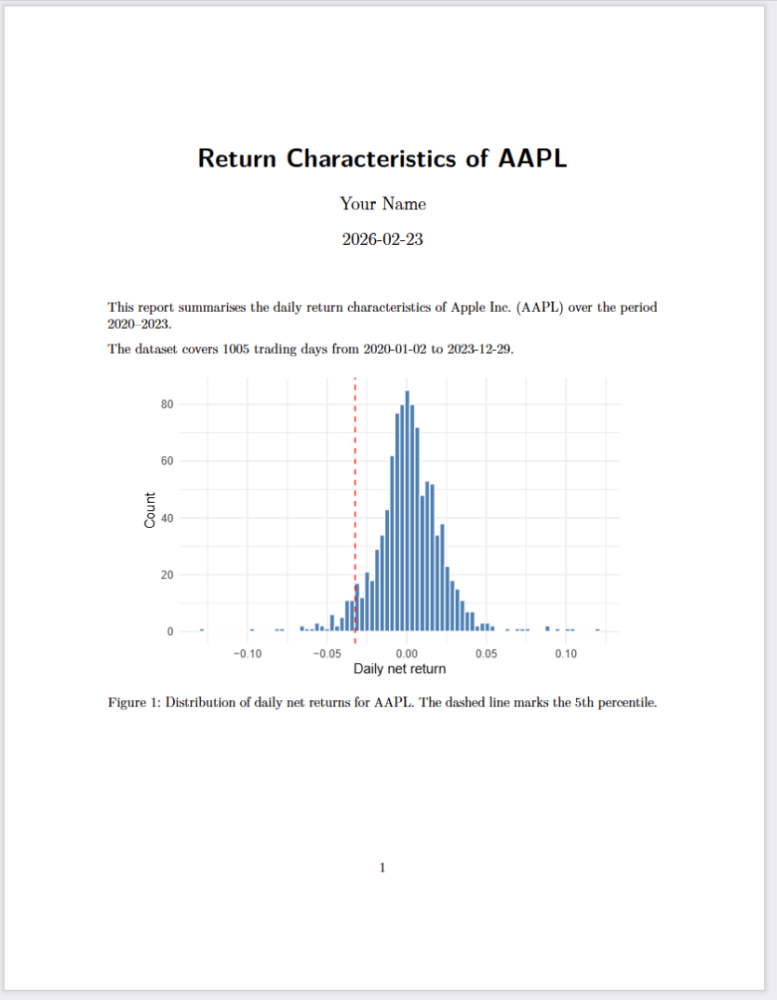
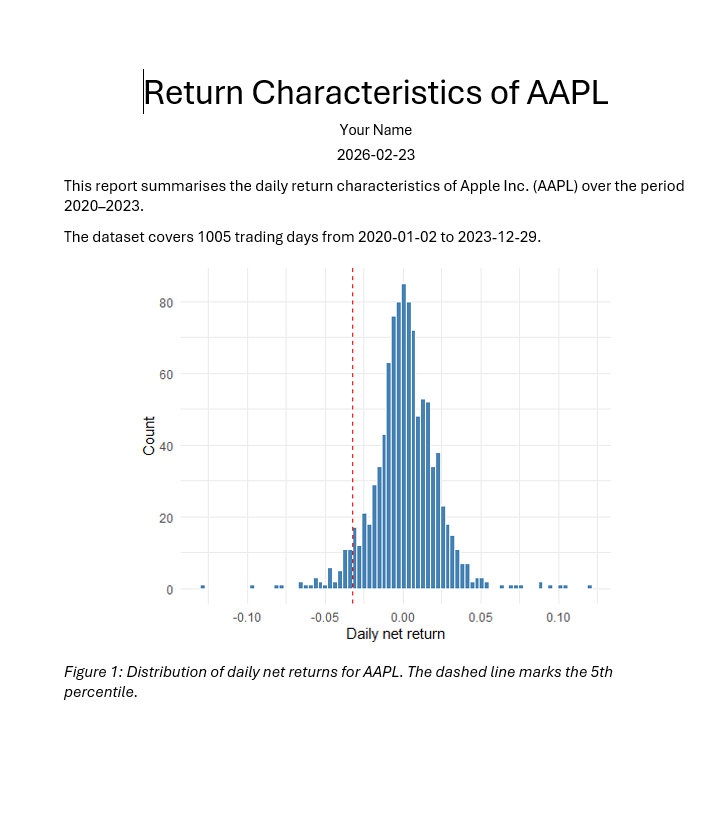
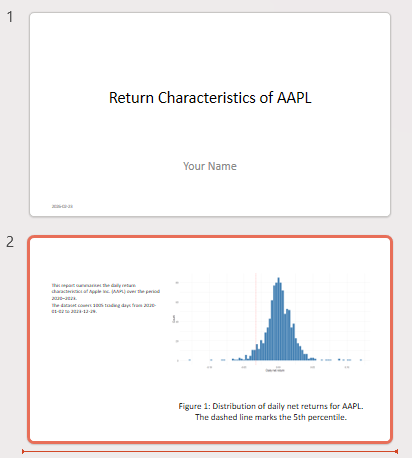

## Why reproducible documents?

Suppose you are asked to write a short report on the return characteristics of Apple stock (AAPL) — either for a research project or for a portfolio manager who wants a quick data-driven summary. The report should show the price history, the distribution of daily returns, and a table of summary statistics.

You write the code in R or Python (or Julia), it works, and you copy the plot and the numbers into a Word document. You send it off. Your supervisor reads it and asks two things: can you extend the sample back to 2015, and can you add a line in the histogram that marks the 1% quantile instead of the 5%? Small changes — but now you have to re-run the code, find the right figure in the output, replace it in the document, locate the numbers in the table, update them by hand, and hope you did not miss anything. If this happens three times across a two-week revision cycle, the manual overhead adds up fast and the risk of inconsistencies grows.

**Literate programming** solves such issues by putting code, output, and explanation into a single file. When you render it, the code runs and the results flow into the document automatically. Changing the start date or the quantile threshold is a one-line edit; re-rendering takes care of the rest. Nothing is copied by hand; nothing can fall out of sync.

Here is what the core of such a report looks like in Quarto. Do not worry about the details yet — we will cover each piece carefully in the sections below. For now, just notice that the code, the plot, and the prose all live in the same file


````{verbatim}
#| filename: "aapl-report.qmd"
---
title: "Return Characteristics of AAPL"
author: "Your Name"
date: today
format: html
execute:
  echo: false
  warning: false
  message: false
---

This report summarises the daily return characteristics of Apple Inc. (AAPL)
over the period 2020–2023.

```{r}
#| include: false

library(tidyfinance)
library(dplyr)
library(tidyr)
library(ggplot2)

prices <- download_data(
  type       = "stock_prices",
  symbols    = "AAPL",
  start_date = "2020-01-01",
  end_date   = "2023-12-31"
)

returns <- prices |>
  mutate(ret = adjusted_close / lag(adjusted_close) - 1) |>
  drop_na(ret)
```

The dataset covers `{r} nrow(returns)` trading days from
`{r} min(prices$date)` to `{r} max(prices$date)`.

```{r}
#| label: fig-returns
#| fig-cap: "Distribution of daily net returns for AAPL. The dashed line marks the 5th percentile."

ggplot(returns, aes(x = ret)) +
  geom_histogram(bins = 80, fill = "steelblue", color = "white") +
  geom_vline(
    xintercept = quantile(returns$ret, 0.05),
    linetype = "dashed", color = "red"
  ) +
  labs(x = "Daily net return", y = "Count") +
  theme_minimal()
```
````

A few things to notice even before we explain the syntax:

- The **date range** (`2020-01-01` to `2023-12-31`) appears in one place — in the `download_data()` call. To extend the sample, you change that one line and re-render.
- The **quantile threshold** (`0.05`) appears in one place — inside `geom_vline()`. Switching to the 1% quantile means changing `0.05` to `0.01`.
- The **sentence** *"The dataset covers ..."* is not typed manually. It is computed at render time, so it always matches the data.

This is the promise of literate programming, and this report is what we will build step by step throughout this tutorial.

A reproducible document serves three audiences:

- **Decision-makers** — they see polished results without any code.
- **Collaborators and your future self** — they can follow both the analysis and the reasoning behind it.
- **Reviewers and replicators** — they can verify that the results actually follow from the data and code.

In this course, your mandatory assignment must be submitted as a reproducible document. Everything you learn here applies directly to that task.

## What is Quarto?

**Quarto** is an open-source publishing system made by Posit (the team behind Positron). A Quarto file has the extension `.qmd` and contains three things: a metadata header, prose in Markdown, and executable code in R or Python. When you *render* it, Quarto runs the code, collects the output, and hands everything to **pandoc** to produce a final document — HTML, PDF, Word, and more.

.](https://cdn.myportfolio.com/45214904-6a61-4e23-98d6-b140f8654a40/c2ef45f1-4a68-4c7a-a43f-bdcf0f90e104_rw_3840.png?h=783eba914284e5adfb9feadcf4ba5f1e)

You already have everything installed: Positron ships with Quarto, and TinyTeX (installed during the technical prerequisites) enables PDF output.

## The Anatomy of a Quarto file

A `.qmd` file has three parts: a YAML header, Markdown prose, and code chunks.

### The YAML Header

The YAML header sits at the very top of the file, enclosed between two `---` lines. It uses `key: value` pairs to set document metadata and options.

````yaml
---
title: "Stock Market Analysis"
author: "Your Name"
date: today
format: html
---
````

The most common fields:

| Key | What it does | Example |
|---|---|---|
| `title` | Document title | `"Stock Market Analysis"` |
| `author` | Author name | `"Your Name"` |
| `date` | Date shown in output; `today` inserts automatically | `today` |
| `format` | Output format | `html`, `pdf`, `docx` |

You can also set *document-wide code defaults* under `execute`. These apply to every chunk unless a chunk overrides them:

```yaml
---
title: "Stock Market Analysis"
format: pdf
execute:
  echo: false
  warning: false
---
```

#### Output formats

Changing a single line in the YAML header switches the entire output format. The three formats you will use most are shown below.

::: {.panel-tabset}

## HTML

```yaml
---
title: "Stock Market Analysis"
author: "Your Name"
date: today
format: html
---
```

*Rendered output:*



## PDF

```yaml
---
title: "Stock Market Analysis"
author: "Your Name"
date: today
format: pdf
---
```

*Rendered output:*



## Word

```yaml
---
title: "Stock Market Analysis"
author: "Your Name"
date: today
format: docx
---
```

*Rendered output:*



## Powerpoint

```yaml
---
title: "Stock Market Analysis"
author: "Your Name"
date: today
format: pptx
---
```

*Rendered output:*



:::

### Narrative in Markdown

Everything outside code chunks is **Markdown** — a simple syntax for formatting plain text. The most important elements:

**Headings** — use `#` signs, one per level:

```markdown
# Section
## Subsection
### Sub-subsection
```

**Emphasis**:

```markdown
*italic*    **bold**
```

**Lists** — bullet with `-`, numbered with `1.`:

```markdown
- Download prices for AAPL
- Compute daily net returns
- Plot the return distribution
```

**Links** — `[display text](url)`:

```markdown
We follow [Tidy Finance with R](https://www.tidy-finance.org/r/introduction-to-tidy-finance.html).
```

**Images** — same as links but with a leading `!`:

```markdown

```

**Inline code** — backticks render text in a monospaced font, useful for function and package names:

```markdown
Use `download_data()` from the `tidyfinance` package.
```


**Math** — use LaTeX notation. Inline math goes between single `$`; display math between `$$`:

```markdown
The daily net return is $r_t = (p_t - p_{t-1})\,/\,p_{t-1}$.

$$
\min_\omega \; \omega^\top \Sigma\, \omega
\quad \text{s.t.} \quad
\iota^\top \omega = 1
$$
```

**Citations** — Quarto uses Pandoc's citation syntax. Write `[@key]` in your prose, where `key` matches an entry in a `.bib` file, and point to that file in the YAML header under `bibliography`:

```markdown
We follow the approach of @fama1993 and construct monthly factor returns [@carhart1997].
```

```yaml
---
title: "Stock Market Analysis"
bibliography: references.bib
---
```

Quarto inserts a formatted reference list at the end of the document automatically. The citation style defaults to Chicago author-date; you can switch it by adding `csl: apa.csl` (or any other CSL file) to the YAML header. For a full reference on citation syntax — including page numbers, suppressing author names, and supported bibliography formats — see the [Quarto citations documentation](https://quarto.org/docs/authoring/citations.html).

### Code Chunks

Code chunks are enclosed in triple backticks with the language in curly braces. Quarto executes the chunk when rendering and inserts the output below it.

**R chunk:**

````{verbatim}
```{r}
library(tidyfinance)

prices <- download_data(
  type       = "stock_prices",
  symbols    = "AAPL",
  start_date = "2020-01-01",
  end_date   = "2023-12-31"
)
```
````

**Python chunk:**

````{verbatim}
```{python}
import tidyfinance as tf

prices = tf.download_data(
    domain     = "stock_prices",
    symbols    = "AAPL",
    start_date = "2020-01-01",
    end_date   = "2023-12-31"
)
```
````

You can also run a chunk interactively — without rendering the full document — by selecting the code and pressing **Ctrl + Enter**, exactly as in a plain script.

#### Chunk Labels

Add a label with `#|` to name the chunk. Labels appear in Positron's document outline and make it easier to navigate long files. Plot chunks that start with `fig-` get automatic figure numbering.

````{verbatim}
```{r}
#| label: fig-prices

ggplot(prices, aes(x = date, y = adjusted)) +
  geom_line()
```
````

#### Execution Options

Options prefixed with `#|` control what appears in the rendered output. Place them at the top of the chunk, one per line.

| Option | What it does |
|---|---|
| `echo: false` | Run the code, show the output, hide the code |
| `eval: false` | Show the code, do not run it |
| `include: false` | Run the code silently — no code, no output shown |
| `warning: false` | Suppress warnings |
| `message: false` | Suppress package loading messages |
| `cache: true` | Save the result and skip re-running if the chunk is unchanged |
| `fig-cap: "..."` | Caption for a plot |
| `fig-width: 7` | Figure width in inches |

#### Caching Slow Chunks

When a chunk takes a long time to run — downloading data, fitting a model, running a simulation — you can add `cache: true`. Quarto saves the result to disk the first time the chunk runs. On every subsequent render, if the chunk code has not changed, Quarto loads the saved result instead of re-running the code. This can cut render times from minutes to seconds.

````{verbatim}
```{r}
#| label: download-prices
#| cache: true

prices <- download_data(
  type       = "stock_prices",
  symbols    = c("AAPL", "MSFT", "GOOGL"),
  start_date = "2000-01-01",
  end_date   = "2023-12-31"
)
```
````

Two things to keep in mind:

- **The label is required.** Quarto uses the chunk label as the cache file name. A chunk without a label cannot be cached reliably — always add `#| label:` when using `cache: true`.
- **The cache is invalidated when the chunk code changes.** If you edit the chunk, Quarto detects the change and re-runs it automatically. However, it does *not* detect changes in upstream objects (e.g. if a helper function defined in an earlier chunk changes). In that case, delete the `<filename>_cache/` folder (e.g. `my-analysis_cache/`) and re-render from scratch.

A typical pattern: one silent setup chunk that loads packages and data, followed by a display chunk that shows only the plot:

````{verbatim}
```{r}
#| label: ex-sec3-load-data
#| include: false

library(tidyfinance)
library(dplyr)
library(ggplot2)

prices <- download_data(
  type       = "stock_prices",
  symbols    = "AAPL",
  start_date = "2020-01-01",
  end_date   = "2023-12-31"
)

returns <- prices |>
  arrange(date) |>
  mutate(ret = adjusted_close / lag(adjusted_close) - 1) |>
  drop_na(ret)
```

```{r}
#| label: ex-sec3-fig-return-hist
#| echo: false
#| fig-cap: "Daily return distribution for AAPL, 2020–2023. The dashed line marks the 5th percentile."
#| fig-width: 7
#| fig-height: 4

ggplot(returns, aes(x = ret)) +
  geom_histogram(bins = 80, fill = "steelblue", color = "white") +
  geom_vline(
    xintercept = quantile(returns$ret, 0.05),
    linetype   = "dashed",
    color      = "red"
  ) +
  labs(x = "Daily net return", y = "Count") +
  theme_minimal()
```
````

## Rendering Your Document

### From Positron

Two options:

1. **Command palette** (**Ctrl + Shift + P**) → type `Quarto: Preview` → press Enter. Quarto renders the document and shows a live preview in the Viewer pane.
2. **Render on Save**: enable `Quarto: Render on Save` in the command palette. Every **Ctrl + S** then triggers a re-render automatically.

The output file is saved in the same folder as your `.qmd` file.

### From the Terminal

Open the Terminal tab in Positron (not the Console) and run:

```bash
# Render using the format set in the YAML header
quarto render my-analysis.qmd

# Override the output format
quarto render my-analysis.qmd --to pdf
quarto render my-analysis.qmd --to html
```

This is useful for rendering without opening a preview, or as part of an automated workflow.

### The Rendering Pipeline

Knowing the steps helps when something goes wrong:

1. Quarto reads the `.qmd` file.
2. Code chunks are sent to the execution engine — **knitr** for R, **Jupyter** for Python.
3. The engine runs the code and returns all output (text, tables, plots).
4. Quarto assembles code, output, and Markdown into a single `.md` file.
5. **pandoc** converts that file into the final output format.

If rendering fails, Quarto tells you which step broke and why. The most common causes are a missing package, a code error, or a LaTeX issue when rendering to PDF.

.](https://cdn.myportfolio.com/45214904-6a61-4e23-98d6-b140f8654a40/b5217f2a-f129-4bf9-90dc-c5b9783d0ea8_rw_3840.png?h=a41d29d8ce363dbc153f3bcc1abe085a)

## Checklist

Work through the tasks below in order. By the time you reach the last item you will have all the skills needed to focus on the mandatory assignment.

### Step 1 — Write a plain script

- [ ] Create a new R or Python script (`.R` or `.py`) in your project folder. The script should contain some computations, optimally creating a plot and a table. For example, you could download stock prices, compute returns, and plot the return distribution.
- [ ] Run the script from top to bottom without errors.

### Step 2 — Turn your script into a Quarto document

- [ ] Create a new file `my-analysis.qmd` with a YAML header (title, author, `date: today`, `format: html`).
- [ ] Set `echo: false` and `warning: false` globally under `execute`.
- [ ] Add a short introductory paragraph in Markdown explaining what the document does.
- [ ] Include at least one display-math formula (e.g. the definition of net return).
- [ ] Add a silent setup chunk (`#| include: false`) that loads packages and downloads data.
- [ ] Add a labelled figure chunk (`#| label: fig-...`) that plots the return distribution with a caption.
- [ ] Add a table of summary statistics (mean, standard deviation, min, max of daily returns). I recommand using `gt::gt()` (R) or `great_tables` (Python).
- [ ] Write one sentence in prose that uses inline code execution, for instance to report the number of trading days covered.
- [ ] Render to HTML and check that all output appears correctly.

### Step 3 — Experiment with output formats

- [ ] Replace `format: html` with `format: pdf` to the YAML header and render to PDF. Fix any LaTeX errors that appear.
- [ ] Switch to `format: docx` and render to Word. Check that tables and figures transfer cleanly.

### Step 4 — Render the mandatory assignment template

- [ ] Open the mandatory assignment template from the course repository.
- [ ] Read the YAML header and the instructions in the template carefully.
- [ ] Render the unmodified template to pdf to confirm your environment is set up correctly.
- [ ] Fill in your name in the `author` field and add your solutions chunk by chunk.
- [ ] In case you get stuck, refer to the template's comments and the Quarto documentation. You can also ask for help in the discussion forum on Absalon.  
